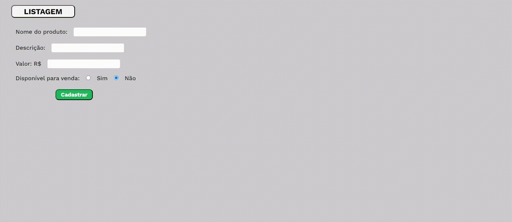

# Stock <h6>ENGLISH</h6>

<h2 align="center">A web stock about products with PostgreSQL linked in Supabase</h2>

The website has the functions to add products, remove, edit products and a button to view the details of each item.
A basic design.

<h1 align="center">
</img>
</h1>

<h2>It has 6 columns for each product: Id, Name, Description, Value, Available and Added moment.</h2>

<h2>Columns:</h2>
<li>ID - The IDs are ordered from the most expensive product to the least expensive.</li>
<li>Name - name of the product added.</li>
<li>Description - a few words about the item, it's not required.</li>
<li>Value - a float number, only 2 decimal places, in reais.</li>
<li>Available - a boolean condition where True(Yes) means available for selling and False(No) means not.</li>
<li>Added moment - it records the moment you registered that item (yyyy/mm/dd/ - hour/minute/seconds).</li>

<h2>There is a env file in the .gitignore that contains the URL connection string and environment variables for my app.
So I won't expose the database to everyone in my GitHub.</h2>

  <footer>
     
    <h4><a href="https://www.instagram.com/vinyyboy_seewald/" target="_blank"></img></a></h4>
    <h4>| Made with ❤️ by: Rafael Seewald👋|</h4>
  </footer>

